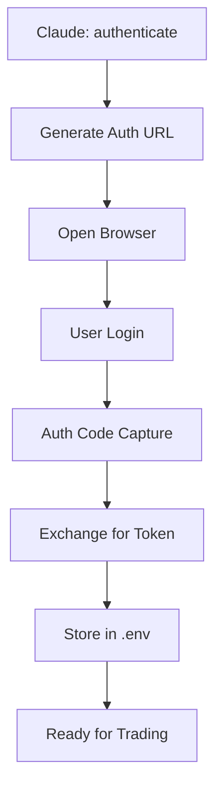

# Fyers MCP Server

> **MCP (Model Context Protocol) server for Fyers API v3 with automated OAuth authentication**

[](https://www.python.org/downloads/)
[](https://fyers.in/api/)
[](https://opensource.org/licenses/MIT)

A comprehensive MCP server that enables Claude Desktop to interact with Fyers trading platform through a secure, automated authentication flow. Supports all major trading operations including portfolio management, order placement, and real-time market data.

## 🎬 Demo

<video width="100%" controls>
  <source src="assets/fyers-mcp.mp4" type="video/mp4">
  Your browser does not support the video tag. <a href="assets/fyers-mcp.mp4">Download the demo video</a>
</video>

## ✨ Features

### 🔐 **Smart Authentication**
- **One-click OAuth flow** with automatic browser handling
- **Persistent token storage** in `.env` file
- **Auto-refresh** capabilities with session management

### 📊 **Complete Trading Toolkit**
- **Portfolio Management**: Holdings, positions, funds, profile
- **Order Management**: Place, modify, cancel orders
- **Market Data**: Real-time quotes for multiple symbols
- **Order History**: Complete order and trade book

### 🚀 **Production Ready**
- **Full error handling** with detailed error messages
- **Type safety** with parameter validation
- **Comprehensive logging** for debugging
- **Claude Desktop integration** with simple configuration

## 🚀 Quick Start

### Prerequisites

- Python 3.10 or higher
- [Claude Desktop](https://claude.ai/download) installed
- [Fyers Trading Account](https://fyers.in/) with API access

### 1. Installation

```bash
# Clone the repository
git clone https://github.com/quantabox/fyers-mcp-server.git
cd fyers-mcp-server

# Install dependencies using uv (recommended)
curl -LsSf https://astral.sh/uv/install.sh | sh
uv sync

# Or install with pip
pip install .
```

### 2. Get Fyers API Credentials

1. **Create Fyers API App**:
   - Visit [Fyers API Dashboard](https://myapi.fyers.in/dashboard/)
   - Create a new app with redirect URI: `http://localhost:8080/`
   - Note down your `App ID` and `Secret Key`

2. **Configure Environment**:
   ```bash
   cp .env.example .env
   ```
   
   Edit `.env` file:
   ```env
   FYERS_CLIENT_ID=YOUR_APP_ID-100     # e.g., ABC123XYZ-100
   FYERS_SECRET_KEY=YOUR_SECRET_KEY    # Secret from Fyers app
   FYERS_REDIRECT_URI=http://localhost:8080/
   ```

### 3. Configure Claude Desktop

Add to your Claude Desktop configuration file:

**macOS**: `~/Library/Application Support/Claude/claude_desktop_config.json`  
**Windows**: `%APPDATA%\Claude\claude_desktop_config.json`

```json
{
  "mcpServers": {
    "fyers-mcp-server": {
      "command": "uv",
      "args": [
        "run", 
        "--directory",
        "/path/to/fyers-mcp-server",
        "python",
        "fyers_mcp_complete.py"
      ],
      "env": {
        "PYTHONWARNINGS": "ignore"
      }
    }
  }
}
```

### 4. First Run

1. **Restart Claude Desktop**
2. **Authenticate**: In Claude, type: `authenticate`
3. **Browser will open** → Login to Fyers → Automatic token capture
4. **Start trading**: All 11 tools are now available!

## 🛠️ Available Tools

### Authentication & Profile
- `authenticate()` - One-click OAuth authentication
- `check_auth_status()` - Verify current authentication
- `get_profile()` - User profile information

### Portfolio & Funds
- `get_funds()` - Account balance and margin details
- `get_holdings()` - Portfolio holdings with P&L
- `get_positions()` - Current trading positions

### Orders & Trading
- `place_order(symbol, quantity, order_type, side, ...)` - Place new orders
- `modify_order(order_id, quantity, limit_price, ...)` - Modify existing orders
- `cancel_order(order_id)` - Cancel pending orders
- `get_orders()` - Order history and status

### Market Data
- `get_quotes(symbols)` - Real-time quotes for multiple symbols

## 📖 Usage Examples

### Portfolio Analysis
```
# Check account balance
get_funds()

# View all holdings with P&L
get_holdings()

# Check current positions
get_positions()
```

### Order Management
```
# Place a market order
place_order("NSE:SBIN-EQ", 10, "MARKET", "BUY")

# Place a limit order
place_order("NSE:RELIANCE-EQ", 5, "LIMIT", "BUY", limit_price=2500)

# Modify an order
modify_order("ORDER_ID", quantity=15, limit_price=2550)

# Cancel an order
cancel_order("ORDER_ID")
```

### Market Data
```
# Get live quotes
get_quotes("NSE:SBIN-EQ,NSE:RELIANCE-EQ,NSE:TCS-EQ")
```

## 🔧 Configuration Options

### Order Types
- `MARKET` - Market order (immediate execution)
- `LIMIT` - Limit order (execute at specific price)
- `STOP` - Stop loss order
- `STOPLIMIT` - Stop limit order

### Product Types
- `MARGIN` - Margin trading (intraday with leverage)
- `CNC` - Cash and Carry (delivery)
- `INTRADAY` - Intraday trading
- `BO` - Bracket Order
- `CO` - Cover Order

### Validity Options
- `DAY` - Valid for current trading day
- `IOC` - Immediate or Cancel
- `GTD` - Good Till Date

## 🐛 Troubleshooting

### Common Issues

**1. Authentication Failed**
```bash
# Check credentials in .env file
cat .env | grep FYERS

# Verify app configuration at https://myapi.fyers.in/dashboard/
```

**2. Claude Desktop Connection Issues**
```bash
# Test MCP server directly
cd /path/to/fyers-mcp-server
uv run python fyers_mcp_complete.py

# Check Claude Desktop logs (macOS)
tail -f ~/Library/Logs/Claude/mcp.log
```

**3. Order Placement Errors**
- Verify symbol format: `NSE:SYMBOL-EQ` for equity
- Check market hours (9:15 AM - 3:30 PM IST)
- Ensure sufficient funds/margin

### Debug Mode

Enable detailed logging:
```bash
export LOG_LEVEL=DEBUG
uv run python fyers_mcp_complete.py
```

## 🚧 Development

### Project Structure
```
fyers-mcp-server/
├── fyers_mcp_complete.py    # Main MCP server
├── pyproject.toml          # Dependencies
├── .env.example           # Environment template
├── claude_config.json     # Claude Desktop config
└── README.md             # This file
```

### Adding New Features

1. **Fork the repository**
2. **Create feature branch**: `git checkout -b feature/new-tool`
3. **Add MCP tool**: Use `@mcp.tool()` decorator
4. **Test with Claude Desktop**
5. **Submit pull request**

### Testing

```bash
# Install development dependencies
uv sync --dev

# Run tests
uv run pytest

# Type checking
uv run mypy fyers_mcp_complete.py
```

## 📋 API Reference

### Authentication Flow



### Error Handling

All functions return standardized responses:
- ✅ **Success**: Clear confirmation with relevant data
- ❌ **Error**: Detailed error message with troubleshooting hints

## 🤝 Contributing

We welcome contributions! Please see our [Contributing Guidelines](CONTRIBUTING.md) for details.

### Areas for Contribution
- WebSocket real-time data streaming
- Advanced order types (OCO, Iceberg)
- Portfolio analytics and reporting
- Options chain analysis tools
- Risk management features

## 📄 License

This project is licensed under the MIT License - see the [LICENSE](LICENSE) file for details.

## ⚠️ Disclaimer

This software is for educational and development purposes. Trading involves financial risk. Users are responsible for their trading decisions and should thoroughly test in demo environments before live trading.

## 🔗 Links

- [Fyers API Documentation](https://myapi.fyers.in/docsv3)
- [MCP Protocol Specification](https://modelcontextprotocol.io/)
- [Claude Desktop](https://claude.ai/download)
- [Issues & Support](https://github.com/quantabox/fyers-mcp-server/issues)

## 📊 Status

- **Current Version**: 1.0.0
- **API Compatibility**: Fyers API v3.1.7
- **Python Support**: 3.10+
- **Tools Available**: 11/11 ✅
- **Production Ready**: Yes ✅

---

<p align="center">
  <strong>Made with ❤️ for the trading community</strong><br>
  <sub>Enable algorithmic trading with Claude's intelligence</sub>
</p>